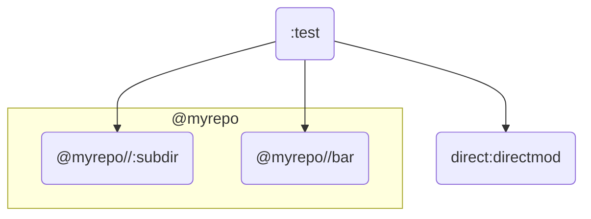

# Test Case: py_library in generated / external repository

See [#276](https://github.com/aspect-build/rules_py/issues/276).

## Structure



## Subdirs

- [./BUILD.bazel](./BUILD.bazel) contains the demonstration `py_test` that makes use of the modules.
- [rules/](rules/) contains the "importer" rule used to create the external repository under test. It simply copies the files from the fixed path `./imported`.
- [direct/](direct/) counterexample showing that a `py_library` from within the `_main` repository is working as expected.
- [imported/](imported/) contains the contents of the external repository to be imported.
- [toplevel/](toplevel/) contains a simple python package defined at the same level as the test (no `imports` required).

## Repro

The `:test` test case imports two modules from `@myrepo` ("flat" using `imports=["."]` and "subdir" using `imports=[".."]`), and two from `_main`. The packages from `_main` are correctly seen by python while the other two are not.

The second test case `:all_direct` skips the `repository_rule` to demonstrate that the `test.py` itself is correctly implemented and can actually pass when the bug is not present.


```console
$ bazel test ...
...
AssertionError: import errors: ["No module named 'flat'", "No module named 'subdir'"]
```
